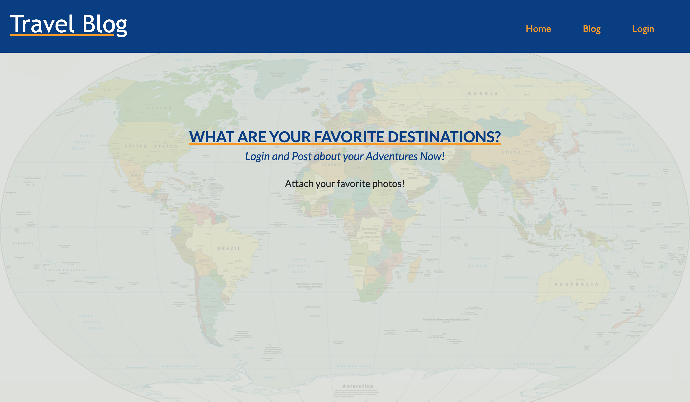
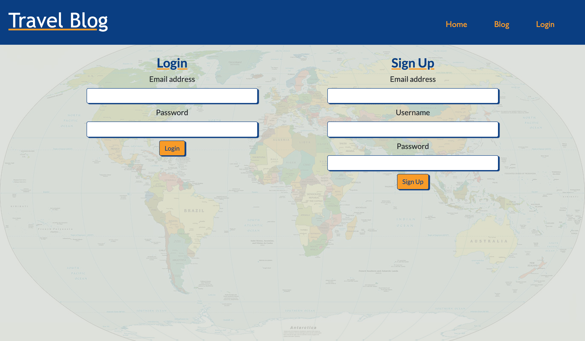
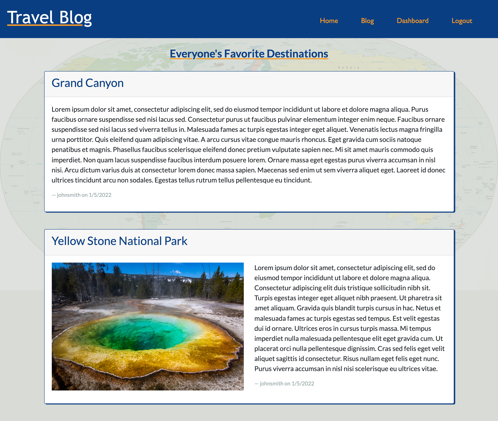
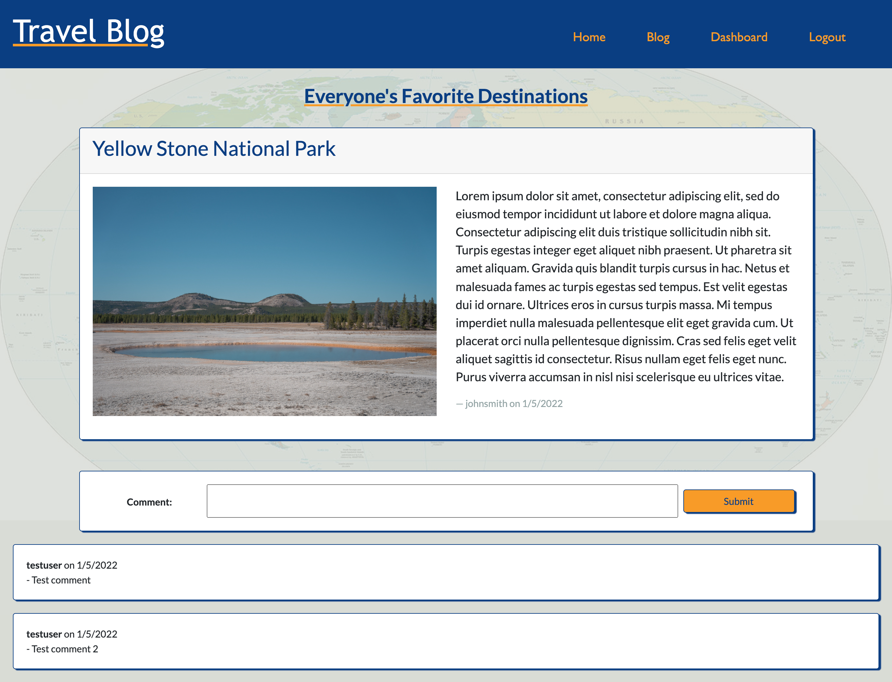
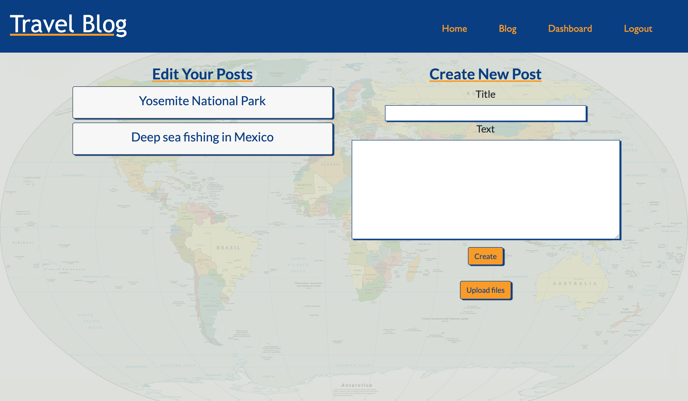
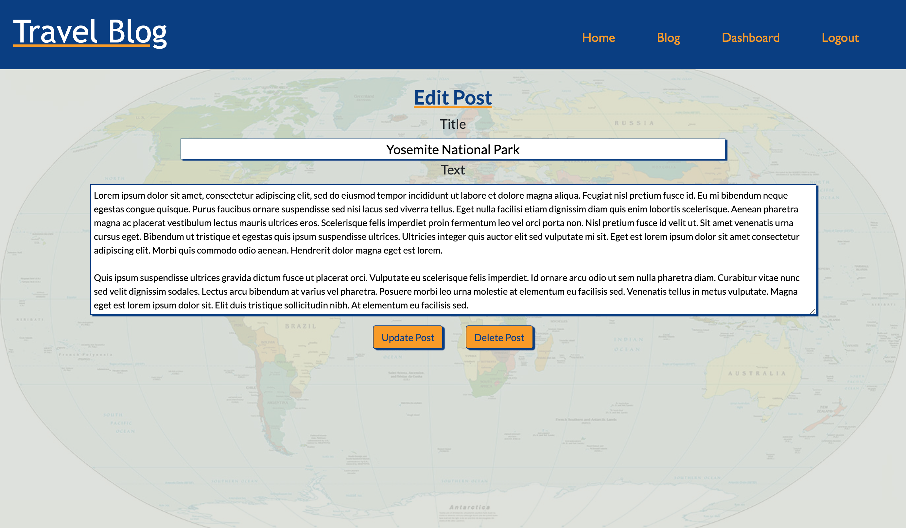

# Project-2 - Travel Blog

## Licensing:

## Table of Contents

  - [Licensing:](#licensing)
  - [Table of Contents](#table-of-contents)
  - [Description:](#description)
  - [Technologies Used to Create This Project:](#technologies-used-to-create-this-project)
  - [Installation:](#installation)
  - [Usage:](#usage)
  - [License](#license)
  - [Contribution:](#contribution)
  - [Testing:](#testing)
  - [Additional Info:](#additional-info)
  - [Screenshots:](#screenshots)

## Description:

This is a group project that was created using the MVC (Model-View-Controller) paradigm. This is a basic CMS style blog site about your favorite destinations. You can go to the site using the Heroku link listed below in the Additional Info section. Or you can run locally by visiting the GitHub account listed below in the Additional Info section and by cloning the repo. If running locally you will need to install the npm packages and create an .env file. Once you are at the site you can view current posts and comments from other travelers. By signing up or logging in you can post your own favorite destinations and upload an image from your adventure. Once you are logged in you can update your post, delete your post or comment on post.

## Technologies Used to Create This Project:

- Node.js
- Express.js
- Handlebars
- bcrypt
- MySql
- Sequelize
- JavaScript
- dotenv
- Cloudinary

## Installation:

No installation is needed if you are using the Heroku link below. If you are using the Heroku link simply click on the link and view the current posts. By signing up or logging in you can start using the site. If you are wanting to run the application locally you will need to start by cloning the repository using the GitHub link below in the Additional Info section and installing node npm.

## Usage:

When first visiting the site you are able to view current blog posts. Once a visitor has signed up or logged in they can create their own favorite destination post and can edit their post or comment on other posts. The registered visitor can also delete any of their posts if it is determined to be needed.

## License

MIT License

Permission is hereby granted, free of charge, to any person obtaining a copy
of this software and associated documentation files (the "Software"), to deal
in the Software without restriction, including without limitation the rights
to use, copy, modify, merge, publish, distribute, sublicense, and/or sell
copies of the Software, and to permit persons to whom the Software is
furnished to do so, subject to the following conditions:

The above copyright notice and this permission notice shall be included in all
copies or substantial portions of the Software.

THE SOFTWARE IS PROVIDED "AS IS", WITHOUT WARRANTY OF ANY KIND, EXPRESS OR
IMPLIED, INCLUDING BUT NOT LIMITED TO THE WARRANTIES OF MERCHANTABILITY,
FITNESS FOR A PARTICULAR PURPOSE AND NONINFRINGEMENT. IN NO EVENT SHALL THE
AUTHORS OR COPYRIGHT HOLDERS BE LIABLE FOR ANY CLAIM, DAMAGES OR OTHER
LIABILITY, WHETHER IN AN ACTION OF CONTRACT, TORT OR OTHERWISE, ARISING FROM,
OUT OF OR IN CONNECTION WITH THE SOFTWARE OR THE USE OR OTHER DEALINGS IN THE
SOFTWARE.

## Contribution:

Team Members- 
[Adam Field](https://github.com/adamjfield), [Bill Morris](https://github.com/bilcon), [Jeramy Sena](https://github.com/JeramySena), [Rob Burson](https://github.com/RobBurson), [Djamel Ramdani](https://github.com/scorpiondz1999)

- Adam Field served as project leader and did the javascript, handlebars and consolidated everyone's files.
- Jeramy Sena provided the models and did the elevator pitch for our presentation.
- Djamel Ramdani provided the new technology of Cloudinary (ability to up load images).
- Rob Burson provided the routes.
- Bill Morris provied the HTML, CSS and the ReadMe.

## Testing:

To test this application you can navigate to the deployed Heroku website by using the link listed below or you can run the server locally and test the functionality of the app. To test by using the local server you will need to clone the repository from the GitHub account listed below and install the node application and then by running 'node index.js' in the terminal.

## Additional Info:

- Heroku Link: [travel-blog-project-2.herokuapp.com/](https://travel-blog-project-2.herokuapp.com/)
- Github: [Link](https://github.com/adamjfield/Travel-Blog)

## Screenshots

